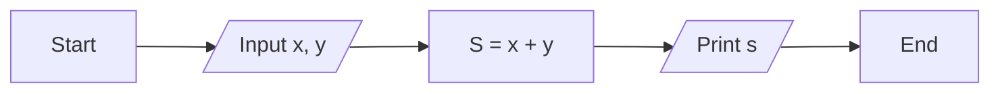
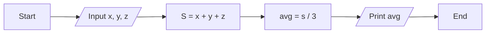

# Introduction To Programming Language

1. What is Program ?
- Set of Instrucstion are Program

Machine only understand 0 & 1 . 
- Compiler & Interpreter can convert programming language to 0 & 1 ( machine language )

### What is Compiler ?
- Compiler is a program that converts source code into machine code, which is then executed by the computer.

### What is interpreter ?
- Interpreter is a program that reads the source code and executes it line by line.

### What is machine language?
- Machine language is the lowest level of programming language. It is the language that is understood by the computer. It is a series of binary digits (0s and 1s) that are executed by the computer.

Let's run your first program in C.

**Write a program that prints "Hello World" on the screen.**

```c
#include <stdio.h>
int main()
{
    printf("Hello World");
    return 0;
}
```
- Input ➡️ **Program** ➡️ Output
- Input ➡️ ***Processing*** ➡️ Output

Example : 
1. Input x, y ➡️ **sum** ➡️ x + y
2. Input x, y ➡️ **Even** ➡️  Yes/No

**Sum 2 numbers flow chart**


**Average flow chart**


**Data Type**
    
    - int (Example : 1, 2, 3, 4, 5)
    - float (Example : 1.234567)
        - Note: After using point(.) it will be float and you can use  6 digit after point. It will be right.
    - char (Example : 'A', 'B', 'C')
    - double (Example : 1.234 567 890 123 456)
        - Note: After using point(.) it will be double and you can use  15 digit after point. It will be right.

**Variable writing rules**

✅ a1  a2

❌ 1a  12a

✅ a1b

❌ Student mark

✅ Student_mark

❌ puncation marks not allow in variables name

❌ keyword ; 
    - Example : if else for while return printf

**Input & Output**

- Input : scanf()
- Output : printf()

```c
#include<stdio.h> // stdio.h is a header file
int main() // main is a function
{
    int x; // x is a variable
    scanf("%d\n", &x); // &x is a address of x
    printf("%d", x); // %d is a format specifier
    return 0; // return 0 is a exit status
}
```
- \n - new line

**WAP to input two numbers and print their sum.**

```c
#include<stdio.h>
int main()
{
    int x, y;
    scanf("%d %d", &x, &y);
    printf("%d", x + y);
    return 0;
}
```
**WAP to find the area of circle.**

```c