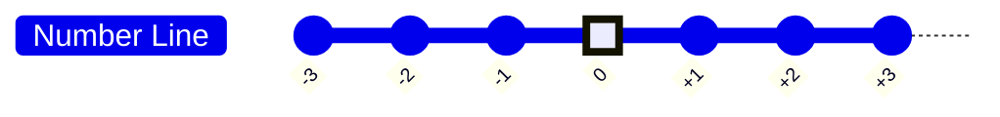
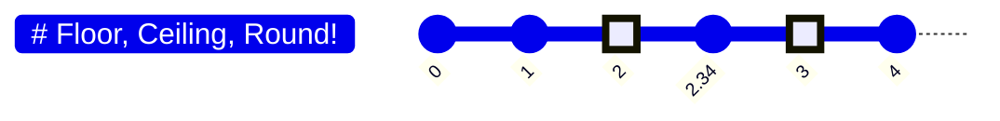

#math_for_programming

# What is Computer?
 
-   A machine that computes somethings

# What is programming?

-   Telling the computer how to perform a task

# What Is Number System? Types Of Number 

-   Count from 0 to 12 

```
    0 ➡1 ➡ 2 ➡ 3 ➡ 4 ➡ 5 ➡ 6 ➡ 7 ➡ 8 ➡ 9 ➡ 10 ➡ 11 ➡ 12
```


| Hundreds | Tens                 | Ones               |
| -------- | -------------------- | ------------------ |
| 0        | 0                    | 0                  |
| 0        | 0                    | 1                  |
| 0        | 0                    | 2                  |
| 0        | 0                    | 3                  |
| 0        | 0                    | 4                  |
| 0        | 0                    | 5                  |
| 0        | 0                    | 6                  |
| 0        | 0                    | 7                  |
| 0        | 0                    | 8                  |
| 0        | 0                    | 9                  |
| 0        | ${\color{green}1}$ | ${\color{red}0}$ |
| 0        | 1                    | 1                  |
| 0        | 1                    | 2                  |
| 0        | 1                    | 3                  |
| 0        | 1                    | 4                  |
| 0        | 1                    | 5                  |
| 0        | 1                    | 6                  |
| 0        | 1                    | 7                  |
| 0        | 1                    | 8                  |
| 0        | 1                    | 9                  |
| 0        | ${\color{green}2}$ | ${\color{red}0}$ |
| 0        | 2                    | 1                  |


➡ Decimal Number System 

```
      0,1,2,3,4,5,6,7,8,9 ➡ 10 digits
```

# What about 2 digits?

➡ Binary Number System

```
       0,1 ➡ 2 digits
```

| Ajuts                | Thousands            | Hundreds           | Tens                 | Ones               |
| -------------------- | -------------------- | ------------------ | -------------------- | ------------------ |
| 0                    | 0                    | 0                  | 0                    | 0                  |
| 0                    | 0                    | 0                  | 0                    | 1                  |
| 0                    | 0                    | 0                  | ${\color{green}1}$ | ${\color{red}0}$ |
| 0                    | 0                    | 0                  | 1                    | 1                  |
| 0                    | 0                    | 1                  | 0                    | 0                  |
| 0                    | 0                    | 1                  | 0                    | 1                  |
| 0                    | 0                    | 1                  | 1                    | 0                  |
| 0                    | 0                    | 1                  | 1                    | 1                  |
| 0                    | ${\color{green}1}$| ${\color{red}0}$| ${\color{red}0}$   | ${\color{red}0}$ |
| 0                    | 1                    | 0                  | 0                    | 1                  |
| 0                    | 1                    | 0                  | 1                    | 0                  |
| 0                    | 1                    | 0                  | 1                    | 1                  |
| 0                    | 1                    | 1                  | 0                    | 0                  |
| 0                    | 1                    | 1                  | 0                    | 1                  |
| 0                    | 1                    | 1                  | 1                    | 0                  |
| 0                    | 1                    | 1                  | 1                    | 1                  |
| ${\color{green}1}$ | ${\color{red}0}$  | ${\color{red}0}$ | ${\color{red}0}$  | ${\color{red}0}$|
| 1                    | 0                    | 0                  | 0                    | 1                  |
| 1                    | 0                    | 0                  | 1                    | 0                  |
| 1                    | 0                    | 0                  | 1                    | 1                  |
| 1                    | 0                    | 1                  | 0                    | 0                  |


# Number System

- How many digits ➡ base

```
Base 10: Decimal [0,1,2,3,4,5,6,7,8,9]

Base 2: Binary [0,1]

Base 8: Octal [0,1,2,3,4,5,6,7]

Base 16: Hexadecimal [0,1,2,3,4,5,6,7,8,9,A,B,C,D,E,F]
```


| Decimal | Binary | Octal | Hexadecimal |
| --- | --- | --- | --- |
| 0 | 0000 | 000 | 0000 |
| 1 | 0001 | 001 | 0001 |
| 2 | 0010 | 002 | 0002 |
| 3 | 0011 | 003 | 0003 |
| 4 | 0100 | 004 | 0004 |
| 5 | 0101 | 005 | 0005 |
| 6 | 0110 | 006 | 0006 |
| 7 | 0111 | 007 | 0007 |
| 8 | 1000 | 010 | 0008 |
| 9 | 1001 | 011 | 0009 |
| 10 | 1010 | 012 | A |
| 11 | 1011 | 013 | B |
| 12 | 1100 | 014 | C |
| 13 | 1101 | 015 | D |
| 14 | 1110 | 016 | E |
| 15 | 1111 | 017 | F |

# Decimal To Decimal Convert


```math
273 
= 200 + 70 +3 = 2 × 100 + 7 ×10 + 3 × 1  = 2 × 10^2 + 7 × 10^1 + 3 × 10^ 0= 2 × b ^ 2 + 7 × b ^ 1 + 3 × b ^ 0
```


```
For Decimal b = 10
```

# Binary To Decimal Convert

```math
1101
= 1 × b ^ 3 + 1 × b ^ 2 + 0 × b ^ 1 + 1 × b ^ 0
= 1 × 2 ^ 3 + 1 × 2 ^ 2 + 0 × 2 ^ 1 + 1 × 2 ^ 0
= 1 × 8 + 1 × 4 + 0 × 2 + 1 × 1
= 8 + 4 + 0 + 1
= 13
```

```
For Binary b = 2
```

# Decimal To Binary Convert

```
13 ÷ 2 = 6, here remainder is 1
6 ÷ 2 = 3, here remainder is 0
3 ÷ 2 = 1, here remainder is 1
1 ÷ 2 = 0, here reminder is 1
```

MSB ➡ LSB

# Types of Numbers




```
- Real number: any point on the number line
- Positive number (right to the zero)
- Negative number (left to the zero)
- Non — negative number (Positive and zero)
- Natural Numbers : {1,2,3,.....}
- Whole Numbers:  {0,1,2,3,.....}
- Integers: {……-3,-2,-1,0,1,2,3,....}
- Rational numbers : {3/4, 1/2, 5/8,....etc}
- Irrational numbers : {(π = 3.1415926536...), (√2 = 1.41421356237....etc)
```

# Let’s learn about division

```
17 ÷ 5 = 3 ; remainder 2

Here, 17 ➡ Dividend
      5  ➡ Divisor
      3  ➡ Quotient
```

# Divisibility Check

-   How to tell if a number P is divisible by another number Q ?
    
    ```
        - There are two ways :
    ```
    
```
- Check if the remainder is zero
   - 12 % 3 = 0 ➡ 12 is divisible by 3
   - 12 % 5 = 2 ➡ 12 is NOT divisible by 5
```

```
- What do we get if we just do the division ?
    - 12/3 = 4 ➡ Integer ➡ 12 is divisible by 3
    - 12/5 = 2.4 ➡ NOT Integer ➡ 12 is NOT divisible by 5
```

# Prime & Composite Numbers

Factor

```
What does it mean when we say “P is a "factor" of Q?“

Answer: P divides Q evenly (Remainder is O). Example: 3 is o factor of 12.

 • Prime: Only two factors. 1 and itself.
 • Composite: There exists at least one factor other than 1 and itself.
```

-   Is 15 a prime number?
    Ans : 15 is divisible by: 1 3,5 15. Not prime!
-   Is 19 a prime number?
    Ans : 19 is divisible by: 1,19. Prime!
-   What about 1? Is it prime or composite?
    Ans : Special case. Neither!

# Even & Odd Numbers

-   How to check?
    
    - Divide the number with 2. If remainder is 0, even! Otherwise, odd!
    
```
Even: 0, 2, 4, 6, 8, 10, . . .
Odd: 1, 3, 5, 7, 9, . . .
```

# Floor, Ceiling, Round!
```
• Floor: Nearest integer below
• Ceiling: Nearest integer above
• Round: Nearest integer
```



| Input | Floor | Ceiling | Round |
| ----- | ----- | ------- | ----- |
| 2.34  | 2     | 3       | 2     |
| 9.21  | 9     | 10      | 9     |
| 24    | 24    | 24      | 24    |
| 12.65 | 12    | 13      | 13    |

# DIVISOR COUNTING

#### Problem statement: Given an integer n. HOW many divisors are there for n?


###### You know the answer if n is a prime, right?
```
Example : 3, 11, 73 etc. There are just two factors: 1 and itself.
```
###### What about if it is not a prime number? How do you count divisors?


```
Example : 8.15, 27 etc. With 1 & itself, there are more than two variables.
```

## DIVISOR COUNTING - NAIVE

• Take all the integers (1 to n) and test if remainder is 0.

➡️ Let'S take 12

| Input | Test   | Output |
| ----- | ------ | ------ |
| 1     | 12%1=0 | ✅     |
| 2     | 12%2=0 | ✅     |
| 3     | 12%3=0 | ✅     |
| 4     | 12%4=0 | ✅     |
| 5     | 12%5=2 | ❌     |
| 6     | 12%6=0 | ✅     | 


| Input | Test    | Output |
| ----- | ------- | ------ |
| 7     | 12%7=5  | ❌     |
| 8     | 12%8=4  | ❌     |
| 9     | 12%9=3  | ❌     |
| 10    | 12%10=2 | ❌     |
| 11    | 12%11=1 | ❌     |
| 12    | 12%12=0 | ✅     |

-  The divisors: 1, 2, 3, 4, 6, 12. Number Of divisors: 6

## DIVISOR COUNTING - BETTER?
• We already know 1 and n will be there!
So, 2 to (n — 1) need to be tested.
• But look at the second half!

➡️ First half✅

| Input | Test   | Output |
| ----- | ------ | ------ |
| 1     | 12%1=0 | ✅     |
| 2     | 12%2=0 | ✅     |
| 3     | 12%3=0 | ✅     |
| 4     | 12%4=0 | ✅     |
| 5     | 12%5=2 | ❌     |
| 6     | 12%6=0 | ✅     | 

➡️ Second half❌

| Input | Test    | Output |
| ----- | ------- | ------ |
| 7     | 12%7=5  | ❌     |
| 8     | 12%8=4  | ❌     |
| 9     | 12%9=3  | ❌     |
| 10    | 12%10=2 | ❌     |
| 11    | 12%11=1 | ❌     |
| 12    | 12%12=0 | ✅     |

- We only need to check for 2 to n/2.

###### What about odd n?

Example :
- Let's take 11
  - 11 ÷ 2 = 5.5
         - Floor 5
         - Ceiling 6
    - Floor × 2 = 10 < 11 ✅
    - Ceiling × 2 = 12 > 11 ❌
- Here, only need to check for 2 to (n/2)-1 

## DIVISOR COUNTING - EVEN BETTER?

➡️ First half✅

| Input               | Test    | Output |
| ------------------- | ------- | ------ |
| 1                   | 12%1=0  | ✅     |
| ${\color{yellow}2}$ | 12%2=0  | ✅     |
| ${\color{blue}3}$   | 12%3=0  | ✅     |
| ${\color{blue}4}$   | 12%4=0  | ✅     |
| 5                   | 12%5=2  | ❌     |
| ${\color{yellow}6}$ | 12%6=0  | ✅     |

➡️ Second half❌

| Input | Test    | Output |
| ----- | ------- | ------ |
| 7     | 12%7=5  | ❌     |
| 8     | 12%8=4  | ❌     |
| 9     | 12%9=3  | ❌     |
| 10    | 12%10=2 | ❌     |
| 11    | 12%11=1 | ❌     |
| 12    | 12%12=0 | ✅     |

- Could you stop eariler than 6 ?
   - Yes
   - 12%2 = 0 means 12÷${\color{yellow}2}$=${\color{yellow}6}$ also divides 12
   - Same goes for ${\color{blue}3}$ & ${\color{blue}4}$
   - So we could stop at 3 & still identify all the divisors.

➡️ Then where do i stop ?
   - For 12, we stopped at 3
   - Let's look at 16

Count Number Of Divisors By Going Sqrt(N)

| ⬇️                  | **INCREASE**        |                     |                     |                      |            |
| ------------------- | ------------------- | ------------------- | ------------------- | -------------------- | ---------- |
| 1                   | ×                   | 16                  | =                   | 16                   |            |
| 2                   | ×                   | 8                   | =                   | 16                   |            |
| ${\color{yellow}4}$ | ${\color{yellow}×}$ | ${\color{yellow}4}$ | ${\color{yellow}=}$ | ${\color{yellow}16}$ | **MIRROR** |
| 8                   | ×                   | 2                   | =                   | 16                   |            |
| 16                  | ×                   | 1                   | =                   | 16                   |            |
|                     | **INCREASE**        | ⬆️                  |                     |                      |            |

- So, We do not need to test any number greater than n
- √12 = 3.464.... , √16 = 4

# Check If a number is prime

- **Primality Test**
```
- Problem Statement: Given an integen n. Determine if n is a prime number or not ?
- Take numbers from 2 to √n
    - If any of them divide n, NOT prime

```

- Is 77 a prime number?
- √77 = 8.77 ...
- Check 2 to 8
       - 77 % 2 = 1
       - 77 % 3 = 2
       - 77 % 4 = 1
       - 77 % 5 = 2
       - 77 % 6 = 5
       - 77 % 7 = 0 ➡️ **Factors : 7 and 77/7 = 11**

- **NOT PRIME**

# Sieve of Eratosthenes

- Identifies all the prime numbers in a given range (very fast)
- Idea: 
     - Step 1 : Take a number (start with 2) & find its multiples in the range
     - Step 2 : Those multiples must be composite, cross them out
     - Step 3 : Proceed to the next number
     - Step 4 : If it's prime, go to step 1, otherwise step 3

- Find out all the prime numbers between 1 to 100

√n = √100 = 10 ;Floor = 10
So, we only need to check for 2 to 10

- Step 1 >> Prime Number : ${\color{green}2}$
- Step 2 >>Cross out all the multiples of 2 (  ${\color{yellow}4,6,8,....}$ )

| 1   | ${\color{green}2}$ | 3   | ${\color{yellow}4}$  | 5   | ${\color{yellow}6}$  | 7   | ${\color{yellow}8}$  | 9   | ${\color{yellow}10}$ |
| --- | ------------------ | --- | ------ | --- | ------ | --- | ------ | --- | ------ |
| 11  | ${\color{yellow}12}$  | 13  | ${\color{yellow}14}$ | 15  | ${\color{yellow}16}$ | 17  | ${\color{yellow}18}$ | 19  | ${\color{yellow}20}$ |
| 21  | ${\color{yellow}22}$  | 23  | ${\color{yellow}24}$ | 25  | ${\color{yellow}26}$ | 27  | ${\color{yellow}28}$ | 29  | ${\color{yellow}30}$ |
| 31  | ${\color{yellow}32}$  | 33  | ${\color{yellow}34}$ | 35  | ${\color{yellow}36}$ | 37  | ${\color{yellow}38}$ | 39  | ${\color{yellow}40}$ |
| 41  | ${\color{yellow}42}$  | 43  | ${\color{yellow}44}$ | 45  | ${\color{yellow}46}$ | 47  | ${\color{yellow}48}$ | 49  | ${\color{yellow}50}$ |
| 51  | ${\color{yellow}52}$  | 53  | ${\color{yellow}54}$ | 55  | ${\color{yellow}56}$ | 57  | ${\color{yellow}58}$ | 59  | ${\color{yellow}60}$ |
| 61  | ${\color{yellow}62}$  | 63  | ${\color{yellow}64}$ | 65  | ${\color{yellow}66}$ | 67  | ${\color{yellow}68}$ | 69  | ${\color{yellow}70}$ |
| 71  | ${\color{yellow}72}$  | 73  | ${\color{yellow}74}$ | 75  | ${\color{yellow}76}$ | 77  | ${\color{yellow}78}$ | 79  | ${\color{yellow}80}$ |
| 81  | ${\color{yellow}82}$  | 83  | ${\color{yellow}84}$ | 85  | ${\color{yellow}86}$ | 87  | ${\color{yellow}88}$ | 89  | ${\color{yellow}90}$ |
| 91  | ${\color{yellow}92}$  | 93  | ${\color{yellow}94}$ | 95  | ${\color{yellow}96}$ | 97  | ${\color{yellow}98}$ | 99  | ${\color{yellow}100}$|

- Step 3 >> ${\color{orange}3}$ is the next prime number
- Step 4 >> Cross out all the multiples of 3 without overlapping with the previous step ( ${\color{violet}9,15,21,27,...}$ )

| 1   | ${\color{green}2}$ | ${\color{orange}3}$ | ${\color{yellow}4}$  | 5   | ${\color{yellow}6}$  | 7   | ${\color{yellow}8}$  | ${\color{violet}9}$  | ${\color{yellow}10}$ |
| --- | ------------------ | ------------------ | ------ | --- | ------ | --- | ------ | ------ | ------ |
| 11  | ${\color{yellow}12}$  | 13  | ${\color{yellow}14}$ | ${\color{violet}15}$  | ${\color{yellow}16}$ | 17  | ${\color{yellow}18}$ | 19  | ${\color{yellow}20}$ |
| ${\color{violet}21}$  | ${\color{yellow}22}$  | 23  | ${\color{yellow}24}$ | 25  | ${\color{yellow}26}$ | ${\color{violet}27}$  | ${\color{yellow}28}$ | 29  | ${\color{yellow}30}$ |
| 31  | ${\color{yellow}32}$  | ${\color{violet}33}$  | ${\color{yellow}34}$ | 35  | ${\color{yellow}36}$ | 37  | ${\color{yellow}38}$ | ${\color{violet}39}$  | ${\color{yellow}40}$ |
| 41  | ${\color{yellow}42}$  | 43  | ${\color{yellow}44}$ | ${\color{violet}45}$  | ${\color{yellow}46}$ | 47  | ${\color{yellow}48}$ | 49  | ${\color{yellow}50}$ |
| ${\color{violet}51}$  | ${\color{yellow}52}$  | 53  | ${\color{yellow}54}$ | 55  | ${\color{yellow}56}$ | ${\color{violet}57}$  | ${\color{yellow}58}$ | 59  | ${\color{yellow}60}$ |
| 61  | ${\color{yellow}62}$  | ${\color{violet}63}$  | ${\color{yellow}64}$ | 65  | ${\color{yellow}66}$ | 67  | ${\color{yellow}68}$ | ${\color{violet}69}$  | ${\color{yellow}70}$ |
| 71  | ${\color{yellow}72}$  | 73  | ${\color{yellow}74}$ | ${\color{violet}75}$  | ${\color{yellow}76}$ | 77  | ${\color{yellow}78}$ | 79  | ${\color{yellow}80}$ |
| ${\color{violet}81}$  | ${\color{yellow}82}$  | 83  | ${\color{yellow}84}$ | 85  | ${\color{yellow}86}$ | ${\color{violet}87}$  | ${\color{yellow}88}$ | 89  | ${\color{yellow}90}$ |
| 91  | ${\color{yellow}92}$  | ${\color{violet}93}$  | ${\color{yellow}94}$ | 95  | ${\color{yellow}96}$ | 97  | ${\color{yellow}98}$ | ${\color{violet}99}$  | ${\color{yellow}100}$|

- Step 5 >> ${\color{red}5}$ is the next prime number
 - Step 6 >> Cross out all the multiples of 5 without overlapping with the previous step ( ${\color{blue}25,35,55,65,85,95}$ )

| 1   | ${\color{green}2}$ | ${\color{orange}3}$ | ${\color{yellow}4}$  | ${\color{red}5}$   | ${\color{yellow}6}$  | 7   | ${\color{yellow}8}$  | ${\color{violet}9}$  | ${\color{yellow}10}$ |
| --- | ------------------ | ------------------ | ------ | ------ | ------ | --- | ------ | ------ | ------ |
| 11  | ${\color{yellow}12}$  | 13  | ${\color{yellow}14}$ | ${\color{violet}15}$  | ${\color{yellow}16}$ | 17  | ${\color{yellow}18}$ | 19  | ${\color{yellow}20}$ |
| ${\color{violet}21}$  | ${\color{yellow}22}$  | 23  | ${\color{yellow}24}$ | ${\color{blue}25}$  | ${\color{yellow}26}$ | ${\color{violet}27}$  | ${\color{yellow}28}$ | 29  | ${\color{yellow}30}$ |
| 31  | ${\color{yellow}32}$  | ${\color{violet}33}$  | ${\color{yellow}34}$ | ${\color{blue}35}$  | ${\color{yellow}36}$ | 37  | ${\color{yellow}38}$ | ${\color{violet}39}$  | ${\color{yellow}40}$ |
| 41  | ${\color{yellow}42}$  | 43  | ${\color{yellow}44}$ | ${\color{violet}45}$  | ${\color{yellow}46}$ | 47  | ${\color{yellow}48}$ | 49  | ${\color{yellow}50}$ |
| ${\color{violet}51}$  | ${\color{yellow}52}$  | 53  | ${\color{yellow}54}$ | ${\color{blue}55}$  | ${\color{yellow}56}$ | ${\color{violet}57}$  | ${\color{yellow}58}$ | 59  | ${\color{yellow}60}$ |
| 61  | ${\color{yellow}62}$  | ${\color{violet}63}$  | ${\color{yellow}64}$ | ${\color{blue}65}$  | ${\color{yellow}66}$ | 67  | ${\color{yellow}68}$ | ${\color{violet}69}$  | ${\color{yellow}70}$ |
| 71  | ${\color{yellow}72}$  | 73  | ${\color{yellow}74}$ | ${\color{violet}75}$  | ${\color{yellow}76}$ | 77  | ${\color{yellow}78}$ | 79  | ${\color{yellow}80}$ |
| ${\color{violet}81}$  | ${\color{yellow}82}$  | 83  | ${\color{yellow}84}$ | ${\color{blue}85}$  | ${\color{yellow}86}$ | ${\color{violet}87}$  | ${\color{yellow}88}$ | 89  | ${\color{yellow}90}$ |
| 91  | ${\color{yellow}92}$  | ${\color{violet}93}$  | ${\color{yellow}94}$ | ${\color{blue}95}$  | ${\color{yellow}96}$ | 97  | ${\color{yellow}98}$ | ${\color{violet}99}$  | ${\color{yellow}100}$|

- Step 7 >> ${\color{lime}7}$ is the next prime number
    - Step 8 >> Cross out all the multiples of 7 without overlapping with the previous step ( ${\color{cyan}49,77,91}$ )

| 1   | ${\color{green}2}$ | ${\color{orange}3}$ | ${\color{yellow}4}$  | ${\color{red}5}$   | ${\color{yellow}6}$  | ${\color{lime}7}$   | ${\color{yellow}8}$  | ${\color{violet}9}$  | ${\color{yellow}10}$ |
| --- | ------------------ | ------------------ | ------ | ------ | ------ | ------ | ------ | ------ | ------ |
| 11  | ${\color{yellow}12}$  | 13  | ${\color{yellow}14}$ | ${\color{violet}15}$  | ${\color{yellow}16}$ | 17  | ${\color{yellow}18}$ | 19  | ${\color{yellow}20}$ |
| ${\color{violet}21}$  | ${\color{yellow}22}$  | 23  | ${\color{yellow}24}$ | ${\color{blue}25}$  | ${\color{yellow}26}$ | ${\color{violet}27}$  | ${\color{yellow}28}$ | 29  | ${\color{yellow}30}$ |
| 31  | ${\color{yellow}32}$  | ${\color{violet}33}$  | ${\color{yellow}34}$ | ${\color{blue}35}$  | ${\color{yellow}36}$ | 37  | ${\color{yellow}38}$ | ${\color{violet}39}$  | ${\color{yellow}40}$ |
| 41  | ${\color{yellow}42}$  | 43  | ${\color{yellow}44}$ | ${\color{violet}45}$  | ${\color{yellow}46}$ | 47  | ${\color{yellow}48}$ | ${\color{cyan}49}$  | ${\color{yellow}50}$ |
| ${\color{violet}51}$  | ${\color{yellow}52}$  | 53  | ${\color{yellow}54}$ | ${\color{blue}55}$  | ${\color{yellow}56}$ | ${\color{violet}57}$  | ${\color{yellow}58}$ | 59  | ${\color{yellow}60}$ |
| 61  | ${\color{yellow}62}$  | ${\color{violet}63}$  | ${\color{yellow}64}$ | ${\color{blue}65}$  | ${\color{yellow}66}$ | 67  | ${\color{yellow}68}$ | ${\color{violet}69}$  | ${\color{yellow}70}$ |
| 71  | ${\color{yellow}72}$  | 73  | ${\color{yellow}74}$ | ${\color{violet}75}$  | ${\color{yellow}76}$ | ${\color{cyan}77}$  | ${\color{yellow}78}$ | 79  | ${\color{yellow}80}$ |
| ${\color{violet}81}$  | ${\color{yellow}82}$  | 83  | ${\color{yellow}84}$ | ${\color{blue}85}$  | ${\color{yellow}86}$ | ${\color{violet}87}$  | ${\color{yellow}88}$ | 89  | ${\color{yellow}90}$ |
| ${\color{cyan}91}$  | ${\color{yellow}92}$  | ${\color{violet}93}$  | ${\color{yellow}94}$ | ${\color{blue}95}$  | ${\color{yellow}96}$ | 97  | ${\color{yellow}98}$ | ${\color{violet}99}$  | ${\color{yellow}100}$|

- Prime numbers : ${\color{green}2}$, ${\color{orange}3}$, ${\color{red}5}$, ${\color{lime}7}$, 11, 13, 17, 19, 23, 29, 31, 37, 41, 43, 47, 53, 59, 61, 67, 71, 73, 79, 83, 89, 97

# Extact Digits From An Integer

- Find the i-th digit of a number (Say n = 91408) from right. ( i = 0,1,3,4 )
	- i = 0 ➡️ n % 10 = 8
	- i = 1 ➡️ Floor(n/10)%10 = 0
	- i = 2 ➡️ Floor(n/100)%10 = 4
	- i = 3 ➡️ Floor(n/1000)%10 = 1
	- i = 4 ➡️ Floor(n/10000)%10 = 9

- Genaeral formula
```math
Floor(n/10^i)%10 = ⌊n/10^i⌋%10
```
