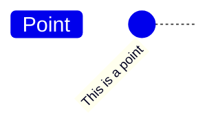
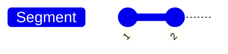
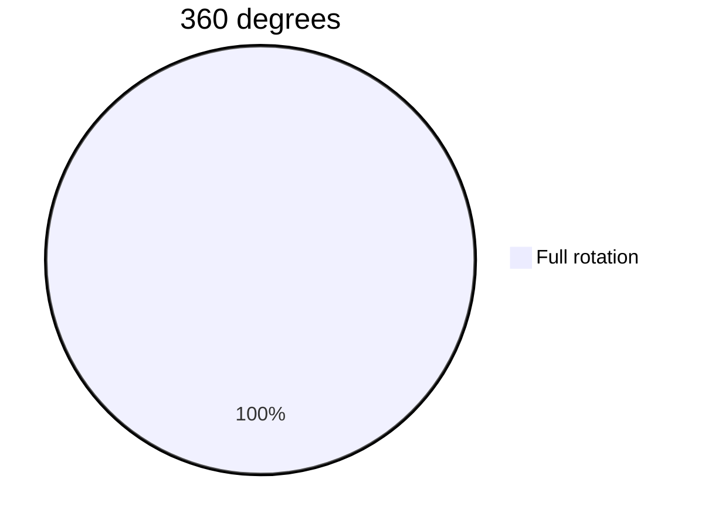
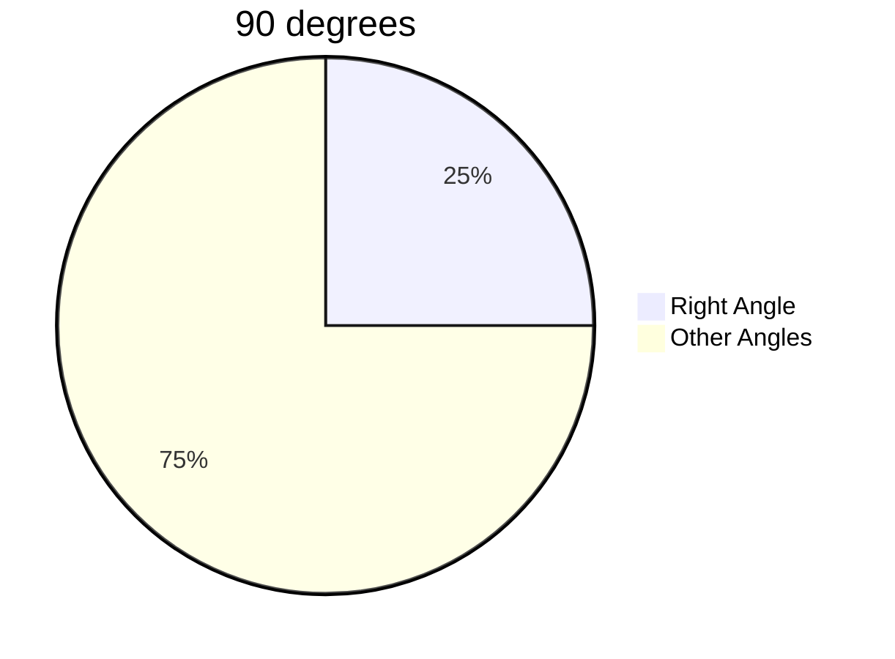
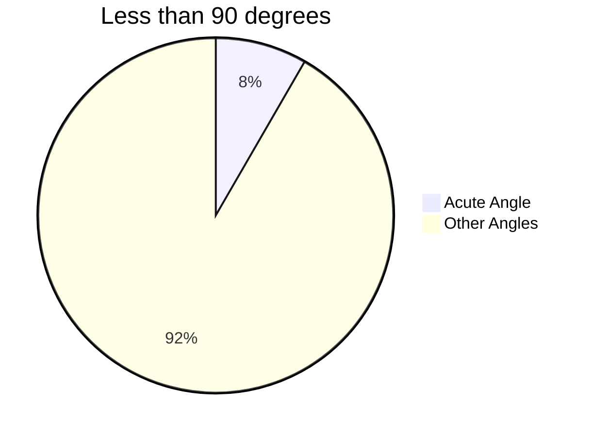
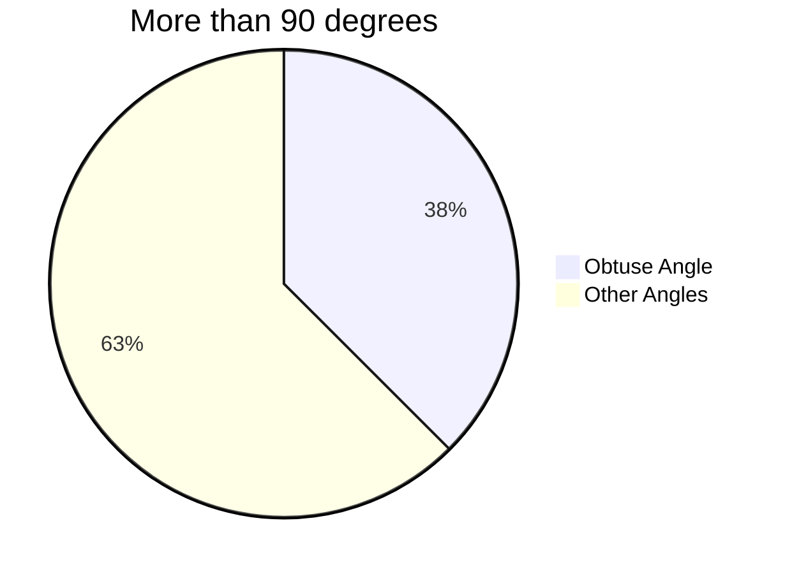
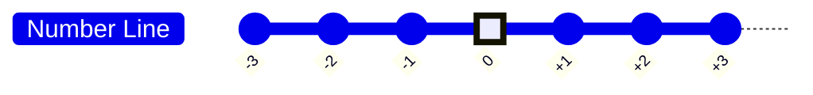

#math_for_programming 

# GCD - Greatest Common Divisior

- Divisor
- Common divisor
- Greatest common divisor
- Example: Find the gcd of 15 & 16
	- Divisors of 15: 1, 3, 5, 15
	- Divisors of 16: 1, 2, 3, 6
	- Common divisors: 1, 3
	- GCD (Great Common Divisor): 3

- Co-prime: If gcd(a, b) = 1, then a & b are co-prime
- Example: 15 & 16 are co-prime
	- Example: 8 & 15

# GCD - How To Calculate?

- Simple way to find gcd(a,b)
	- Take i to be 1 to min(a,b)
	- Check if i divides both a & b
	- Largest such i is the gcd

# GCD - The Euclidean Algorithm

- gcd(a, b) = gcd(b, a mod b)
or, gcd(a, b) = gcd(b, a % b)
- gcd(p, 0) = gcd(0, p) = p
- Example: 
	   gcd(15,6)      //**gcd(a, b)**
	 = gcd(6, 3)     //**gcd(b, a % b)**
	 = gcd(3, 0)    //**gcd(p, 0)**
	 = 3

- Changing order does not matter
	- gcd(6,15) = gcd(15,6) = ... = 3

- gcd(15,8) = gcd(8,7) = gcd(7,1) = gcd(1,0) = 1 ➡️ Co-prime

# LCM - Least Common Multiple

- Multiple
- Common multiple
- Least common multiple
- Example: Find the lcm of 15 & 6
	- Multiples of 15: 15, 30, 45, 60,...
	- Multiples of 6: 6, 12, 18, 24, 30, 36, 42, 48, 54, 60,...
	- Common multiples: 30, 60,...
	- LCM (Least Common Multiple): 30

# LCM - How To Calculate?

- Simple way to find lcm(a,b)
	- Take multiples of the larger number and see if the smaller number divides it

- Or you may find it using gcd:
	```math
	gcd(a, b) * lcm(a, b) = a * b
	```
	-Example: lcm(15,6) = 15 * 6 / 3 = 30

# Factorial

- A function defined for non-negative integers
     - 0,1,2,3,......
```math
n! = n * (n-1) * (n-2) * (n-3) * .... * 3 * 2 * 1
```
- Example: 4! = 4 * 3 * 2 * 1 = 24
- Exception: 0! = 1

```
- 5! = 120 ➡️ divide it by 5 to get 24
- 4! = 24 ➡️ divide it by 4 to get 6
- 3! = 6 ➡️ divide it by 3 to get 2
- 2! = 2 ➡️ divide it by 2 to get 1
- 1! = 1 ➡️ divide it by 1 to get 1
- 0! = 1 
```

- Consider a cricket team with 11 players
- How many batting orders are possible?

- What if we had 2 players ?
    - Answer : 2 (2!)
	- AB or BA

- What if we had 3 players ?
	- Answer : 6 (3!)
	- ABC, ACB, BAC, BCA, CAB, CBA

- Now go for 11 players
	- Answer : 39916800
	- 11! = 11 * 10 * 9 * 8 * 7 * 6 * 5 * 4 * 3 * 2 * 1 = 39916800

# Introduction To Matrices

- Collection of numbers arranged in rows and columns

| A   | 3 Columns |     |     |        |
| --- | --------- | --- | --- | ------ |
| ⬇️  | ⬇️        | ⬇️  |     |        |
| -2  | 5         | 6   | ⬅️  | 2 Rows |
| 5   | 2         | 7   | ⬅️  |        |

- A matrix with 2 rows and 3 columns is called a 2x3 matrix
- Ai,j = ?
	- i = row number
	- j = column number

A2,3 = ?
	- 2nd row
	- 3rd column
	- 7

Where is the 5 located?
	- 1st row
	- 2nd column

- Column Matrix
	- A matrix with 1 column
	- Example: 
```math
\matrix{A} = \begin{bmatrix} 1 \\ 2 \\ 3 \\ 4 \end{bmatrix}
```
- Row Matrix
	- A matrix with 1 row
	- Example: 
```math
\matrix{A} = \begin{bmatrix} 1 & 2 & 3 & 4 \end{bmatrix}
```
# Adding Matrices

- Rows indicate individual students ( 3 students )
- Columns indicate individual exams ( 2 subjects )
- Matrix as an exam result table:
```math
\matrix{Midterm+Final} = \begin{bmatrix} 40 & 36 \\ 28 & 32 \\ 30 & 27 \end{bmatrix}+ \begin{bmatrix} 19 & 35 \\ 48 & 12 \\ 33 & 48 \end{bmatrix} = \begin{bmatrix} 59 & 71 \\ 76 & 44 \\ 63 & 75 \end{bmatrix}
```
# Power And Roots

```math
Power: b^x
```
- Base and exponent

```math
b^x = b * b * b * b *...* b (x times)
```
```math
5^3 = 5 * 5 * 5 = 125
```
Root:(nth root of a)
```math
Root: n\sqrt{a} 
```
- Assume: n√a = x
- Then: x^n = a

```math
2\sqrt{16} = 4
```
```math
4^2 = 16
```
# Introduction To Sets

- A set is a collection of objects
   - No specific order or index
- Objects in a set are called elements
- Example: 
	- Natual number set: { 1, 2, 3, ...}   ➡️ Infinite set
	- Name of favorite sports: { Cricket, Football, Tennis } ➡️ Finite set

# Intro To Sets

- Subset
	- A is a subset of B if all elements of A are also in B
	- A = {10, 12, 29} and B = { 101, 12, 10, 29, 32 }

- Universal Set
	- When taking about numbers, universal set might be the set of Real Numbers
	- In case of set of favorite sports, universal set might be the set of all sports

- Empty / Null Set
	- A set with no elements
	- Example: { } or ∅

- U = { 1, 2, 3, 4, 5, 6, 7, 8, 9, 10, 11, 12, 13 }
- A = { 1, 2, 3, 4, 7 }
- B = { 3, 4, 5, 6 }
- C = { 4, 6, 7, 8, 9 }

- Three Set operations:
	- Union ➡️ ( A ∪ B ) = { 1, 2, 3, 4, 5, 6, 7 }
	- Intersection ➡️ ( A ∩ B ) = { 3, 4 }
	- Complement ➡️ ( A' ) = U - A = { 5, 6, 8, 9, 10, 11, 12, 13 }

# Point

- A point is a location in space
- Just a dot
- Location only
- No lenght, width, shape, size


# Line

- A line is a set of points
- Connect them
- Take the straight path
	- Also the shortest path
- This is called line segment


- This is called line segment
    - Finite length

- Line : extended in both ends
    - Infinite length

 ```math
 <━━━━━━━━━━━━━━━>
 ```

- Ray : extended in one end
	- Infinite length

 ```math
 ━━━━━━━━━━━━━━━>
 ```

# Angles Coordinate Systems Intro

- Between two rays extending from a common point
- Circular arc to annotate
- Full rotation is 360 degrees








# Coordinate Systems

- One Dimensional Coordinate System

+3 is located at the right
0 is located at the center
-3 is located at the left


In one dimensional coordinate system, we can only move in one direction. We can only move left or right. We can't move up or down.

# 3D Coordinate Systems

- 2D Coordinate System
- Take two perpendicular lines
    - Right angle/ 90 degrees
	- Horizontal : X axis
	- Vertical : Y axis

|     |     |     |     | y   | ⬆️  |     |     |     |     |     |
| --- | --- | --- | --- | --- | --- | --- | --- | --- | --- | --- |
|     |     |     |     | 4   | ⬆️  |     |     |     |     |     |
|     |     |     |     | 3   | ⬆️  |     |     |     |     |     |
|     |     |     |     | 2   | ⬆️  |     |     |     |     |     |
|     |     |     |     | 1   | ⬆️  | 1   | 2   | 3   | 4   | x   |
| ⬅️  | ⬅️  | ⬅️  | ⬅️  | ⬅️  | 0   | ➡️  | ➡️  | ➡️  | ➡️  | ➡️  |
| x'  | -4  | -3  | -2  | -1  | ⬇️  | -1  |     |     |     |     |
|     |     |     |     |     | ⬇️  | -2  |     |     |     |     |
|     |     |     |     |     | ⬇️  | -3  |     |     |     |     |
|     |     |     |     |     | ⬇️  | -4  |     |     |     |     |
|     |     |     |     |     | ⬇️  | y'  |     |     |     |     |

-  3D Coordinate System
- 90 degrees (angle) between X and Y axis
- 90 degrees (angle) between Y and Z axis
- 90 degrees (angle) between Z and X axis

|     |     |     |     | y   | ⬆️  |     |     |     | z   | ↗️  |
| --- | --- | --- | --- | --- | --- | --- | --- | --- | --- | --- |
|     |     |     |     |     | ⬆️  |     |     |     | ↗️  |     |
|     |     |     |     |     | ⬆️  |     |     | ↗️  |     |     |
|     |     |     |     |     | ⬆️  |     | ↗️  |     |     |     |
|     |     |     |     |     | ⬆️  | ↗️  |     |     |     | x   |
| ⬅️  | ⬅️  | ⬅️  | ⬅️  | ⬅️  | 🎈  | ➡️  | ➡️  | ➡️  | ➡️  | ➡️  |
| x'  |     |     |     | ↙️  | ⬇️  |     |     |     |     |     |
|     |     |     | ↙️  |     | ⬇️  |     |     |     |     |     |
|     |     | ↙️  |     |     | ⬇️  |     |     |     |     |     |
|     | ↙️  |     |     |     | ⬇️  |     |     |     |     |     |
| ↙️  | z'  |     |     |     | ⬇️  | y'  |     |     |     |     |

3D Coordinate System is hard to explain in plain text. It's easy in real life. 

# Triangle
- 3 points and 3 line segments
- Sum of three angles is 180 degrees

```
    A
   / \
  /   \
 /     \
B───────C
```
```math
Area = 1/2 * Base * Height
```
```
    A
   /|\
  / | \
 /  |⬅️\  Height
B───|───C
  ⬆️Base
```
- Isosceles Triangle
	- Two sides are equal
	- Two angles are equal
- Equilateral Triangle
	- All sides are equal
	- All angles are equal
- Right-Angle Triangle
	- One angle is 90 degrees
	- Hypotenuse is the longest side
- Scalene Triangle
	- No sides are equal
	- No angles are equal

# Square

- 4 sides and 4 line segments
- All sides are equal
- Each angle is 90 degrees
- Sum of all angles is 360 degrees

```
A ── B
│   │
C ── D
```

```math
Area = (Side_length)^2 = a^2
```
```math
Length of diagonal = \sqrt{2} * (Side_length)
```
# Pythagorean Theorem

```
      A
     / \
    /   \
   /     \
  /       \
 B\       /D───────E
   \     / |       |
    \  c/  |b      |
     \ /   |       |
      C────F───────G
      | a  |
      H────I
```
- A, B, C, D, E, F, G, H, I are points
- AB, BC, CD, DE, EF, FG, FH, HI are line segments
- ABC, BCD, CDE, DEF, EFG, FGH, FHI are triangles
- ABCD, CFHI, DEFG are squares

- Pythagorean Theorem

```math
-c^2 = a^2 + b^2
```
- Pythagorean Theorem is used to find the length of the hypotenuse of a right-angle triangle.
- Right-angle triangle and square
	Example:
	```math 
	5^2 = 3^2 + 4^2
	```
	```math
	13^2 = 5^2 + 12^2
	```
# Distance Between Two Points

- Can you apply Pythagorean Theorem to get the distance between A and B?

```
A(x1, y1)
B(x2, y2)
   Y|
  y2|──              B(x2, y2)
    |               / |
    |              /  |
    |             /   |
    |            /    |
  y1|──  (x1,y1)A─────90°
(0,0)───────────|─────|─────────────
                x1    x2           X
```
- Distance between A and B
```math
d = \sqrt{(x2-x1)^2 + (y2-y1)^2}
```
# Rectangle

- 4 sides and 4 line segments
- Opposite sides are equal
- Opposite angles are equal
- Sum of all angles is 360 degrees

```
A────────B
│        │
C────────D
```
```math
Area = Length * Height
```
# Circle

- 1 point and 1 line segment
- 360 degrees
- 2π radians
- Radius is the distance from the center to the edge of the circle
- Diameter is the distance from one edge to the other edge of the circle


```math
Area = π * (Radius)^2
```
# Series

- Sequnce: List of numbers with some order or pattern
    - 1, 3, 5, 7, 9
	- 1, 1, 2, 3, 5, 8, 13, ...

" Fibonacci Sequence or Fibonacci Series "

Series: Sum of elements in a sequence
```math
S¹ = 1 + 3 + 5 + 7 + 9
```
```math
S² = 1 + 1 + 2 + 3 + 5 + 8 + 13 + ...
```
- Finite vs. Infinite Series
    - S¹ is finite
	- S² is infinite
- Arithmetic Series vs. Geometric Series
	
	Arithmetic Series
	```math
	1 + 6 + 11 + 16 + 21 + 26 + 31 + ...
	```
	Geometric Series
	```math
	2 + 6 + 18 + 54 + 162 + 486 + ...
	```

# Sum of natural numbers

- 1+2+3+...+n = ? ( This is a Arithmetic Series )

- Easy way to solve this problem

```
1 + 2 + 3 + 4 + 5 = ?
Let,
```
```math
S = 1 + 2 + 3 + 4 + 5
```
```math
S = 5 + 4 + 3 + 2 + 1
```
```math
(+),2S = 6 + 6 + 6 + 6 + 6
```
```math
2S = 6*5
```
```math
S = 30
```
- **Advanced way to solve this problem**

```math
S = 1 + 2 + 3 + ... + N
```
```math
S = N + (N-1) + (N-2) + ... + 1
```
```math
(+),2S = (N+1) + (N+1) + (N+1) + ... + (N+1)
```
```math
2S = (N+1)*N
```
```math
S = (N+1)*N / 2
```
# Sum of arithmetic series

## Series ( Finite Sum)

- Arithmetic Series
```math
S = 2 + 5 + 8 + ...
```
```
1. Find the 100th number in this series
2. Find the sum of the first 100 numbers in this series
```
- First Question

```math
nth term in an arithmetic series = a + (n-1)d
```
```math
100th number in this series = 2 + (100-1)3
```
	- a means the first number in the series
	- d means the difference between two consecutive numbers in the series
	- n means the position of the number in the series

- Second Question

```math
Sum of first n terms in an arithmetic series = n/2 * {2a + (n-1)d}
```
```math
Sum of first 100 numbers in this series = 100/2 * {2(2) + (100-1)(3)} = 100/2 * {4 + 297} = 100/2 * 301 = 15050
```
# Unitary Method

- Find value for single unit
- Then multiply for necessary units

```
You and your 6 friends went to a restaurant. All ordered the same meal, and the total bill was 1218Taka. Now if you go there with your 2 best friends and have the same meal, what would be the bill this time?
```
- Solution

```math
Cost for 7 people = 1218
```
```math
Cost for 1 person = 1218/7 = 174
```
```math
Cost for 3 people = 174 * 3 = 522
```
```
Tom finished his homework within 15 hours while Jerry takes 10 hours. How many hours will the same homework take to be done if they work together?
```
- Solution

```math
Tom's 15 hour of work ≡ 1 homework
```
```math
Tom's 1 hour of work ≡ 1/15 homework
```
```math
Jerry's 10 hour of work ≡ 1 homework
```
```math
Jerry's 1 hour of work ≡ 1/10 homework
```
```math
Tom and Jerry's 1 hour of work combined ≡ (1/15 + 1/10)homework = 1/6 homework
```
```math
1 homework ≡ 6 hours
```
# Percentage

```
You give a test on 40 marks. You score was 32. What would be the score if  the test was taken with 100 marks.
```
- Solution

```math
Out of 40 marks, you scored 32 marks
```
```math
Out of 1 you scored = 32/40
```
```math
Out of 100 marks, you scored = (32/40) * 100 = 80 marks
```

```
A clothing store is selling one of their most popular products at 870Tk after 40% discount. What was the original price?
```
- Solution

```math
The discounted price = x * (100-40)% = x * 60/100 = 870
```
```math
The original price = 870 * 100/60 = 1450
```

```
The price of oil increased by 25% and then decreased by 15%. What is the net percentage of increase or decrease in oil price?
```
- Solution

```
Let's assume the initial price was 100
Increase by 25% = 100 * 125/100 = 125
Decrease by 15% = 125 * 85/100 = 106.25
Net increase = 106.25 - 100 = 6.25 if the original price was 100(per hundred)
Answer : Increase by 6.25%
```
# Capital And Interest


- Capital = Principal Amount
- Interest = Interest Amount
- Rate = Interest Rate

- Simple Interest vs. Compound Interest
- Simple Interest

```math
I = P* n * r
```
```math
I = Principal Amount * Time unit * Interest Rate
```
```
Your frind deposited 7000Tk in Sonali Bank for 3 years which earn him an interest of 8%. What is the amount he gets after 3 years?
```
- Solution

```math
I = P * n * r
```
```math
I = 7000 * 3 * 8/100 = 1680
```

```
You deposit 5400Tk and got bank an amount of 6000Tk after 2 years. Find the simple interest rate of the bank.
```
- Solution

```math
I = P * n * r
```
```math
I = 5400 * 2 * r
```
```math
6000 = 5400 * 2 * r
```
```math
6000 = 10800 * r
```
```math
r = 6000/10800 = 5.55%
```
- Compound Interest

```math
A = P * (1 + r)^n
```
```math
After n years, the amount of money you have = Principal Amount * (1 + Interest Rate)^n
```
```
You deposit 5000Tk in a bank which gives you 10% interest per year. How much money will you have after 3 years?
```
- Solution

```math
A = P * (1 + r)^n
```
```math
A = 5000 * (1 + 10/100)^3
```
```math
A = 5000 * (1.1)^3
```
```math
A = 5000 * 1.331
```
```math
A = 5000 * 1331/1000
```
```math
A = 6655Tk
```

# Mean & Median

- Mean is the average of a set of numbers. It is calculated by adding all the numbers and dividing the sum by the total number of numbers in the set.

Mean Formula

```math
\overline{x}= \frac{1}{n} \sum_{i=1}^{n} x_{i}
```
- x is the set of numbers
- n is the total number of numbers in the set
- i is the position of the number in the set
- Summation means adding all the numbers in the set

```
You and your friends went to a restaurant. Everyone puts their money on the table and order the same meal for all within budget. How much is the maximum badget for each person?
- Money collected from 6 friends 103, 210, 57, 85, 500, 180
```
**- Solution**

```math
Everyone has a budget of at most the average amount = (103 + 210 + 57 + 85 + 500 + 180)/6 = 189.167
```
- Median is the middle number in a set of numbers.
  If count of numbers is odd, then the middle number is the median.
  If count of numbers is even, then the median is the average of the two middle numbers.

```
8, 7, 3, 2, 10
Sort: 2, 3, 7, 8, 10
Median = 7

8, 7, 3, 2, 10, 1
Sort: 1, 2, 3, 7, 8, 10
Median = (3 + 7)/2 = 5
```

```
You try to walk everyday around 4km. Here is history of ten days of your walking.
```

- 3.5km, 4.4km, 5k.m, 4.5km, 24km, 5km, 5.5km, 5km, 6.5km.

```
Mean: (3.5 + 4.4 + 5 + 4.5 + 24 + 5 + 5.5 + 5 + 6.5)/9 = 6.5km

- Let's look at median
Sort: 3.5, 4.4, 4.5, 5, 5, 5.5, 6.5, 24
Median = (5 + 5)/2 = 5km
```
**Median connot be deviated as much as mean by some outliers.**

# Combinatorics

- Number of ways to choose or arrange objects

```
How many ways are there to choose r objects from a collection of n objects?
```
```math
^{n}C_{r} = ?
```
How many ways are there to arrange r objects from a collection of n objects?
```math
^{n}P_{r} = ?
```
# nPr

- You have n objects in hand ( all different )
- You have r slots to put them (r ≤ n) in order

```
Answering order in an exam to answer 4 out of 6 questions.
```
**Number of ways to arrange 4 questions out of:**
```math
6 * 5 * 4 * 3 = 360
```
**But you can write it as:**
```math
\frac{(6*5*4*3*2*1)}{(2*1)} = \frac{6!}{2!}
```
- Number of permutations :
```math
n * (n-1) * (n-2) * (n-3) * ... * (n-r+1)
```
Or.
```math
\frac{n * (n-1) * (n-2) *...* (n-r+1) * (n-r) *...* 1}{(n-r) *...* 1} = \frac{n!}{(n-r)!}
```

```
Answering order in an exam to answer 4 out of 6 questions.
```
**Number of ways to arrange 4 questions out of:**
```math
^{n}P_{r} = \frac{n!}{(n-r)!} = \frac{6!}{(6-4)!} = \frac{6!}{2!} = 360
```

```
Batting order of 11 players cricket match from a squad of 15 players?
```
```math
\begin{align*}
r &= 11 \\
n &= 15 \\
^{n}P_{r} &= \frac{n!}{(n-r)!} = \frac{15!}{(15-11)!} = \frac{15!}{4!} = 1365
\end{align*}
```

# nCr

- You have n objects in hand ( all different )
- You have r slots to put them (r ≤ n) [ order doesn't matter ]
- You can choose any r objects from n objects

- Number of permutations :
```math
^{n}P_{r} = \frac{n * (n-1) * (n-2) *...* (n-r+1)}
```
- Each r! corresponds to the same choice

```math
^{n}C_{r} = ^{n}P_{r} / r! = \frac{n!}{r! * (n-r)!}
```

```
Batting order of 11 players cricket match from a squad of 15 players?
```
```math
\begin{align*}
r &= 11 \\
n &= 15 \\
^{n}C_{r} &= \frac{n!}{r! * (n-r)!} = \frac{15!}{11! * (15-11)!} = \frac{15!}{11! * 4!} = 3003
\end{align*}
```
# Probability

- Probability is a number to indicate the change or likelihood of a particular event.
- Event: outcome of an experiment or process

```
- The number is between 0 and 1
	- 0 means the event is impossible
	- 1 means the event is certain
```
```math
P(event) = /frac{Number of ways it can happen}{Number of all possible outcomes}
```

```
What is the probability of getting a prime number if you throw a 6-faced dice?
```
- All Possible Outcomes: 1, 2, 3, 4, 5, 6
- Target Outcomes / Prime Numbers: 2, 3, 5

```math
P = \frac{3}{6} = \frac{1}{2} = 0.5
```

```
What is the probability of getting exactly 2 heads if you throw three coins?
```
- Outcomes of single coin: H, T
- Outcomes of Two coins: HH, HT, TH, TT

| | **H** | **T** |
| --- | --- | --- |
| **H** | HH | HT |
| **T** | TH | TT |

- Outcomes of Three coins: HHH, HHT, HTH, HTT, THH, THT, TTH, TTT

| | **HH** | **HT** | **TH** | **TT** |
| --- | --- | --- | --- | --- |
| **H** | HHH | HHT | HTH | HTT |
| **T** | THH | THT | TTH | TTT |

```math
P = \frac{3}{8} = 0.375
```

- You can do it without using a table

Number of possible outcomes: 
```math
2 * 2 * 2 = 8
```
- Outcomes with exactly 2 heads out of 3 trails:

	- Choose 2 positions out of 3 for H

```math
\begin{align*}
^{3}C_{2} &= \frac{3!}{2! * (3-2)!} = \frac{3!}{2! * 1!} = \frac{3!}{2!} = 3 \\
P &= \frac{3}{8}
\end{align*}
```
# Binary <--> Octal

- 000 to 111 = 0 to 7 in octal
- 0000 to 1111 = 0 to F in hexadecimal

```
Binary 10111011 to Octal
```
```math
\begin{align*}
010 && 111 && 011 \\
2 && 7 && 3 \\
\end{align*}
```

| 010 | 111 | 011 | **Binary** |
| --- | --- | --- | --- |
|⬇️|⬇️|⬇️|  |
| 2 | 7 | 3 | **Octal** |

```
Octal 314 to Binary
```
```math
\begin{align*}
3 && 1 && 4 \\
011 && 001 && 100 \\
\end{align*}
```

| 3 | 1 | 4 | **Octal** |
| --- | --- | --- | --- |
|⬇️|⬇️|⬇️|  |
| 011 | 001 | 100 | **Binary** |

# Binary <--> Hexadecimal

- 0000 to 1111 = 0 to F in hexadecimal

```
Binary 10111011 to Hexadecimal
```
```math
\begin{align*}
0101 && 1011 \\
5 && B \\
\end{align*}
```

| 0101 | 1011 | **Binary** |
| --- | --- | --- |
|⬇️|⬇️|  |
| 5 | B | **Hexadecimal** |

```
Hexadecimal 5B to Binary
```
```math
\begin{align*}
5 && B \\
0101 && 1011 \\
\end{align*}
```

| 5 | B | **Hexadecimal** |
| --- | --- | --- |
|⬇️|⬇️|  |
| 0101 | 1011 | **Binary** |

# Practice Day 1

```
Convert this binary number to hexadecimal : 01110100111011
```

```math
\begin{align*}
01 && 1101 && 0011 && 1011 \\
1 && D && 3 && B \\
1D3B \\
\end{align*}
```

| 01 | 1101 | 0011 | 1011 | **Binary** |
| --- | --- | --- | --- | --- |
|⬇️|⬇️|⬇️|⬇️|  |
| 1 | D | 3 | B | **Hexadecimal** |

```
Convert this octal number to hexadecimal : 127416
```

```math
\begin{align*}
Convert && 127416 && to && binary \\
1 && 2 && 7 && 4 && 1 && 6 \\
001 && 010 && 111 && 100 && 001 && 110 \\
0010101111000110  \\
\end{align*}
```
- 0010101111000110 binary to hexadecimal

```math
\begin{align*}
0010 && 1011 && 1100 && 0110 \\
2 && B && C && 6 \\
2BC6 \\
\end{align*}
```

| 0010 | 1011 | 1100 | 0110 | **Binary** |
| --- | --- | --- | --- | --- |
|⬇️|⬇️|⬇️|⬇️|  |
| 2 | B | C | 6 | **Hexadecimal** |

```
If you throw a dice and toss a coin at the same time, what is the probability that you will get Head (coin) and less than 3 (dice)?
```
- Outcomes of single coin: H, T
- Outcomes of single dice: 1, 2, 3, 4, 5, 6

- Probability of getting Head (coin) :

```math
P(H) = \frac{1}{2}
```

- Probability of getting less than 3 (dice) :

```math
P(<3) = \frac{2}{6}
```

- Probability of getting Head (coin) and less than 3 (dice) :

```math
P(H and <3) = \frac{1}{2} * \frac{2}{6} = \frac{1}{6}
```

```
10 people came to party. Everyone shock hands with everyone. How many handshakes took place ?
```

```math
\begin{align*}
10 && people \\
\frac{10!}{2! * (10-2)!} && handshakes \\
\frac{10!}{2! * 8!} && handshakes \\
\frac{10!}{2!} && handshakes \\
\frac{10!}{2! * 1!} && handshakes \\
\frac{10!}{2!} && handshakes \\
\frac{10!}{2} && handshakes \\
\frac{10 * 9}{2} && handshakes \\
45 && handshakes \\
\end{align*}
```
```
Section A and B have 25 students and 20 students, respectively. If a team of 11 players need to be formed and 6 students must be from A and the others from B, how many ways are there to form the team? How many batting order would be there?

```

```math
\begin{align*}
Number && of && ways && to && form && team \\
\frac{25!}{6! * (25-6)!} && \frac{20!}{5! * (20-5)!} \\
177100 * 15504 && ways \\
2742705104 \\
\end{align*}
```

```math
\begin{align*}
Number && of && batting && order && for && 11 && players \\
11! \\
11 * 10 * 9 * 8 * 7 * 6 * 5 * 4 * 3 * 2 * 1 \\
39916800 \\
\end{align*}
```
