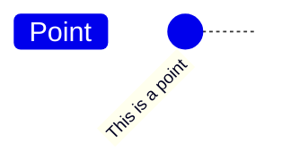
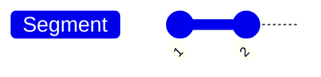
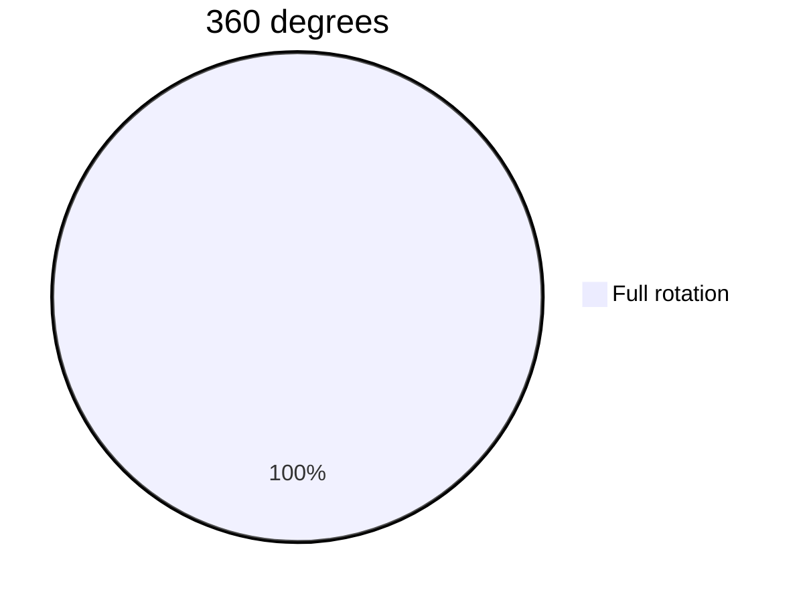
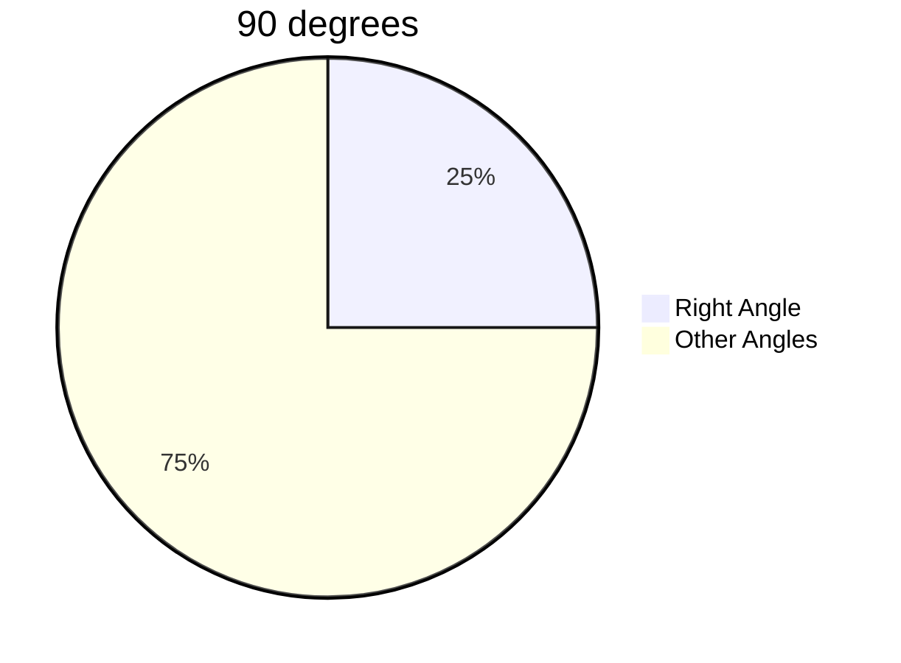
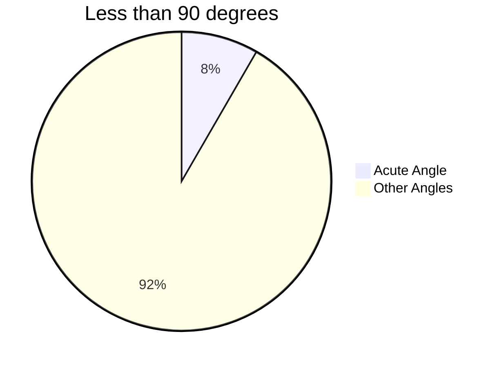
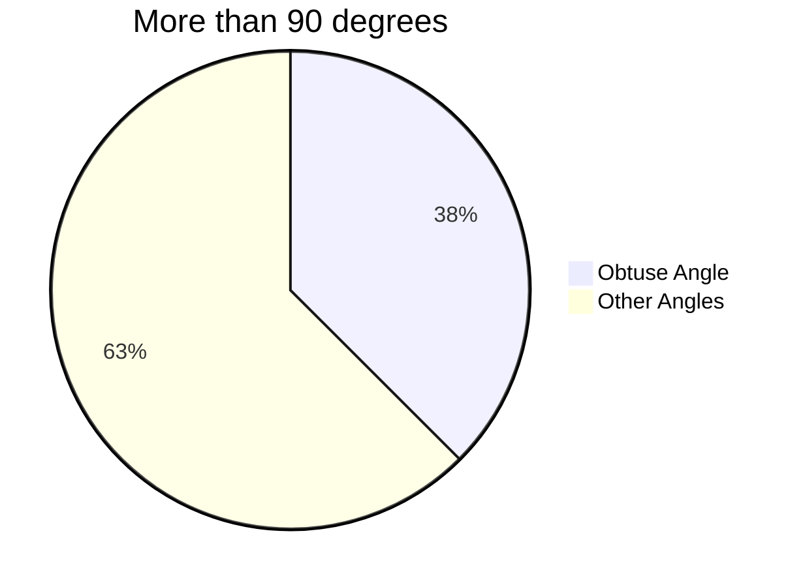
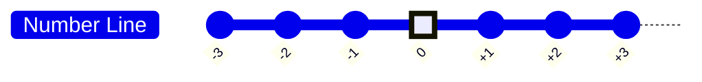

#math_for_programming 

# GCD - Greatest Common Divisior

- Divisor
- Common divisor
- Greatest common divisor
- Example: Find the gcd of 15 & 16
	- Divisors of 15: 1, 3, 5, 15
	- Divisors of 16: 1, 2, 3, 6
	- Common divisors: 1, 3
	- GCD (Great Common Divisor): 3

- Co-prime: If gcd(a, b) = 1, then a & b are co-prime
- Example: 15 & 16 are co-prime
	- Example: 8 & 15

# GCD - How To Calculate?

- Simple way to find gcd(a,b)
	- Take i to be 1 to min(a,b)
	- Check if i divides both a & b
	- Largest such i is the gcd

# GCD - The Euclidean Algorithm

- gcd(a, b) = gcd(b, a mod b)
or, gcd(a, b) = gcd(b, a % b)
- gcd(p, 0) = gcd(0, p) = p
- Example: 
	   gcd(15,6)      //**gcd(a, b)**
	 = gcd(6, 3)     //**gcd(b, a % b)**
	 = gcd(3, 0)    //**gcd(p, 0)**
	 = 3

- Changing order does not matter
	- gcd(6,15) = gcd(15,6) = ... = 3

- gcd(15,8) = gcd(8,7) = gcd(7,1) = gcd(1,0) = 1 ➡️ Co-prime

# LCM - Least Common Multiple

- Multiple
- Common multiple
- Least common multiple
- Example: Find the lcm of 15 & 6
	- Multiples of 15: 15, 30, 45, 60,...
	- Multiples of 6: 6, 12, 18, 24, 30, 36, 42, 48, 54, 60,...
	- Common multiples: 30, 60,...
	- LCM (Least Common Multiple): 30

# LCM - How To Calculate?

- Simple way to find lcm(a,b)
	- Take multiples of the larger number and see if the smaller number divides it

- Or you may find it using gcd:
	```math
	gcd(a, b) * lcm(a, b) = a * b
	```
	-Example: lcm(15,6) = 15 * 6 / 3 = 30

# Factorial

- A function defined for non-negative integers
     - 0,1,2,3,......
```math
n! = n * (n-1) * (n-2) * (n-3) * .... * 3 * 2 * 1
```
- Example: 4! = 4 * 3 * 2 * 1 = 24
- Exception: 0! = 1

```
- 5! = 120 ➡️ divide it by 5 to get 24
- 4! = 24 ➡️ divide it by 4 to get 6
- 3! = 6 ➡️ divide it by 3 to get 2
- 2! = 2 ➡️ divide it by 2 to get 1
- 1! = 1 ➡️ divide it by 1 to get 1
- 0! = 1 
```

- Consider a cricket team with 11 players
- How many batting orders are possible?

- What if we had 2 players ?
    - Answer : 2 (2!)
	- AB or BA

- What if we had 3 players ?
	- Answer : 6 (3!)
	- ABC, ACB, BAC, BCA, CAB, CBA

- Now go for 11 players
	- Answer : 39916800
	- 11! = 11 * 10 * 9 * 8 * 7 * 6 * 5 * 4 * 3 * 2 * 1 = 39916800

# Introduction To Matrices

- Collection of numbers arranged in rows and columns

| A   | 3 Columns |     |     |        |
| --- | --------- | --- | --- | ------ |
| ⬇️  | ⬇️        | ⬇️  |     |        |
| -2  | 5         | 6   | ⬅️  | 2 Rows |
| 5   | 2         | 7   | ⬅️  |        |

- A matrix with 2 rows and 3 columns is called a 2x3 matrix
- Ai,j = ?
	- i = row number
	- j = column number

A2,3 = ?
	- 2nd row
	- 3rd column
	- 7

Where is the 5 located?
	- 1st row
	- 2nd column

- Column Matrix
	- A matrix with 1 column
	- Example: 
```math
\matrix{A} = \begin{bmatrix} 1 \\ 2 \\ 3 \\ 4 \end{bmatrix}
```
- Row Matrix
	- A matrix with 1 row
	- Example: 
```math
\matrix{A} = \begin{bmatrix} 1 & 2 & 3 & 4 \end{bmatrix}
```
# Adding Matrices

- Rows indicate individual students ( 3 students )
- Columns indicate individual exams ( 2 subjects )
- Matrix as an exam result table:
```math
\matrix{Midterm+Final} = \begin{bmatrix} 40 & 36 \\ 28 & 32 \\ 30 & 27 \end{bmatrix}+ \begin{bmatrix} 19 & 35 \\ 48 & 12 \\ 33 & 48 \end{bmatrix} = \begin{bmatrix} 59 & 71 \\ 76 & 44 \\ 63 & 75 \end{bmatrix}
```
# Power And Roots

```math
Power: b^x
```
- Base and exponent

```math
b^x = b * b * b * b *...* b (x times)
```
```math
5^3 = 5 * 5 * 5 = 125
```
Root:(nth root of a)
```math
Root: n\sqrt{a} 
```
- Assume: n√a = x
- Then: x^n = a

```math
2\sqrt{16} = 4
```
```math
4^2 = 16
```
# Introduction To Sets

- A set is a collection of objects
   - No specific order or index
- Objects in a set are called elements
- Example: 
	- Natual number set: { 1, 2, 3, ...}   ➡️ Infinite set
	- Name of favorite sports: { Cricket, Football, Tennis } ➡️ Finite set

# Intro To Sets

- Subset
	- A is a subset of B if all elements of A are also in B
	- A = {10, 12, 29} and B = { 101, 12, 10, 29, 32 }

- Universal Set
	- When taking about numbers, universal set might be the set of Real Numbers
	- In case of set of favorite sports, universal set might be the set of all sports

- Empty / Null Set
	- A set with no elements
	- Example: { } or ∅

- U = { 1, 2, 3, 4, 5, 6, 7, 8, 9, 10, 11, 12, 13 }
- A = { 1, 2, 3, 4, 7 }
- B = { 3, 4, 5, 6 }
- C = { 4, 6, 7, 8, 9 }

- Three Set operations:
	- Union ➡️ ( A ∪ B ) = { 1, 2, 3, 4, 5, 6, 7 }
	- Intersection ➡️ ( A ∩ B ) = { 3, 4 }
	- Complement ➡️ ( A' ) = U - A = { 5, 6, 8, 9, 10, 11, 12, 13 }

# Point

- A point is a location in space
- Just a dot
- Location only
- No lenght, width, shape, size


# Line

- A line is a set of points
- Connect them
- Take the straight path
	- Also the shortest path
- This is called line segment


- This is called line segment
    - Finite length

- Line : extended in both ends
    - Infinite length

 ```math
 <━━━━━━━━━━━━━━━>
 ```

- Ray : extended in one end
	- Infinite length

 ```math
 ━━━━━━━━━━━━━━━>
 ```

# Angles Coordinate Systems Intro

- Between two rays extending from a common point
- Circular arc to annotate
- Full rotation is 360 degrees








# Coordinate Systems

- One Dimensional Coordinate System

+3 is located at the right
0 is located at the center
-3 is located at the left


In one dimensional coordinate system, we can only move in one direction. We can only move left or right. We can't move up or down.

# 3D Coordinate Systems

- 2D Coordinate System
- Take two perpendicular lines
    - Right angle/ 90 degrees
	- Horizontal : X axis
	- Vertical : Y axis

|     |     |     |     | y   | ⬆️  |     |     |     |     |     |
| --- | --- | --- | --- | --- | --- | --- | --- | --- | --- | --- |
|     |     |     |     | 4   | ⬆️  |     |     |     |     |     |
|     |     |     |     | 3   | ⬆️  |     |     |     |     |     |
|     |     |     |     | 2   | ⬆️  |     |     |     |     |     |
|     |     |     |     | 1   | ⬆️  | 1   | 2   | 3   | 4   | x   |
| ⬅️  | ⬅️  | ⬅️  | ⬅️  | ⬅️  | 0   | ➡️  | ➡️  | ➡️  | ➡️  | ➡️  |
| x'  | -4  | -3  | -2  | -1  | ⬇️  | -1  |     |     |     |     |
|     |     |     |     |     | ⬇️  | -2  |     |     |     |     |
|     |     |     |     |     | ⬇️  | -3  |     |     |     |     |
|     |     |     |     |     | ⬇️  | -4  |     |     |     |     |
|     |     |     |     |     | ⬇️  | y'  |     |     |     |     |

-  3D Coordinate System
- 90 degrees (angle) between X and Y axis
- 90 degrees (angle) between Y and Z axis
- 90 degrees (angle) between Z and X axis

|     |     |     |     | y   | ⬆️  |     |     |     | z   | ↗️  |
| --- | --- | --- | --- | --- | --- | --- | --- | --- | --- | --- |
|     |     |     |     |     | ⬆️  |     |     |     | ↗️  |     |
|     |     |     |     |     | ⬆️  |     |     | ↗️  |     |     |
|     |     |     |     |     | ⬆️  |     | ↗️  |     |     |     |
|     |     |     |     |     | ⬆️  | ↗️  |     |     |     | x   |
| ⬅️  | ⬅️  | ⬅️  | ⬅️  | ⬅️  | 🎈  | ➡️  | ➡️  | ➡️  | ➡️  | ➡️  |
| x'  |     |     |     | ↙️  | ⬇️  |     |     |     |     |     |
|     |     |     | ↙️  |     | ⬇️  |     |     |     |     |     |
|     |     | ↙️  |     |     | ⬇️  |     |     |     |     |     |
|     | ↙️  |     |     |     | ⬇️  |     |     |     |     |     |
| ↙️  | z'  |     |     |     | ⬇️  | y'  |     |     |     |     |

3D Coordinate System is hard to explain in plain text. It's easy in real life. 

# Triangle
- 3 points and 3 line segments
- Sum of three angles is 180 degrees

```
    A
   / \
  /   \
 /     \
B───────C
```
```math
Area = 1/2 * Base * Height
```
```
    A
   /|\
  / | \
 /  |⬅️\  Height
B───|───C
  ⬆️Base
```
- Isosceles Triangle
	- Two sides are equal
	- Two angles are equal
- Equilateral Triangle
	- All sides are equal
	- All angles are equal
- Right-Angle Triangle
	- One angle is 90 degrees
	- Hypotenuse is the longest side
- Scalene Triangle
	- No sides are equal
	- No angles are equal

# Square

- 4 sides and 4 line segments
- All sides are equal
- Each angle is 90 degrees
- Sum of all angles is 360 degrees

```
A ── B
│   │
C ── D
```

```math
Area = (Side_length)^2 = a^2
```
```math
Length of diagonal = \sqrt{2} * (Side_length)
```
# Pythagorean Theorem

```
      A
     / \
    /   \
   /     \
  /       \
 B\       /D───────E
   \     / |       |
    \  c/  |b      |
     \ /   |       |
      C────F───────G
      | a  |
      H────I
```
- A, B, C, D, E, F, G, H, I are points
- AB, BC, CD, DE, EF, FG, FH, HI are line segments
- ABC, BCD, CDE, DEF, EFG, FGH, FHI are triangles
- ABCD, CFHI, DEFG are squares

- Pythagorean Theorem

```math
-c^2 = a^2 + b^2
```
- Pythagorean Theorem is used to find the length of the hypotenuse of a right-angle triangle.
- Right-angle triangle and square
	Example:
	```math 
	5^2 = 3^2 + 4^2
	```
	```math
	13^2 = 5^2 + 12^2
	```
# Distance Between Two Points

- Can you apply Pythagorean Theorem to get the distance between A and B?

```
A(x1, y1)
B(x2, y2)
   Y|
  y2|──              B(x2, y2)
    |               / |
    |              /  |
    |             /   |
    |            /    |
  y1|──  (x1,y1)A─────90°
(0,0)───────────|─────|─────────────
                x1    x2           X
```
- Distance between A and B
```math
d = \sqrt{(x2-x1)^2 + (y2-y1)^2}
```
# Rectangle

- 4 sides and 4 line segments
- Opposite sides are equal
- Opposite angles are equal
- Sum of all angles is 360 degrees

```
A────────B
│        │
C────────D
```
```math
Area = Length * Height
```
# Circle

- 1 point and 1 line segment
- 360 degrees
- 2π radians


```math
Area = π * (Radius)^2
```
